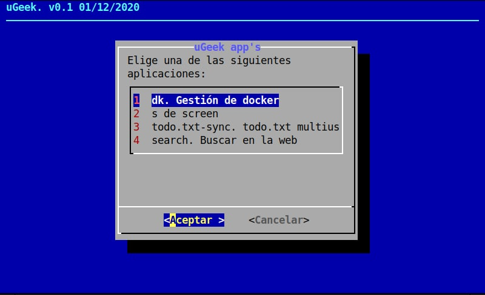

# ugeek-apps
## Descargar script de instalación de app's

```
wget https://raw.githubusercontent.com/uGeek/ugeek-apps/main/ugeek-apps.sh
```

## Ejecutar
```
bash ugeek-apps.sh
```

## Menú
Selecciona en el menú, la app que deseas instalar

